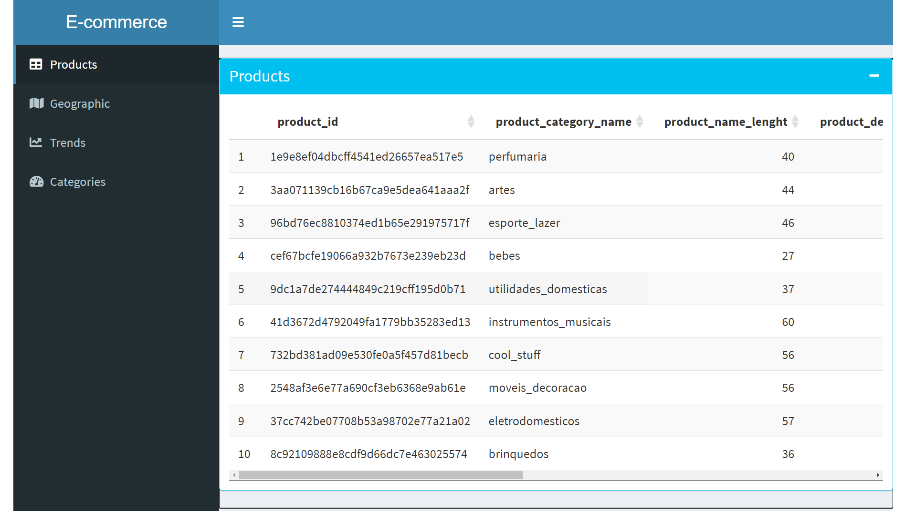
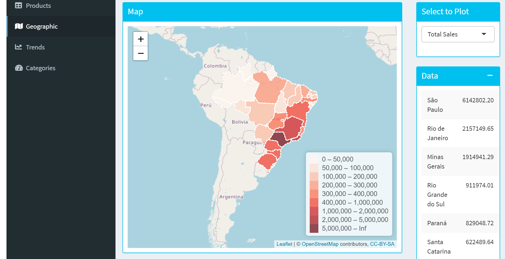
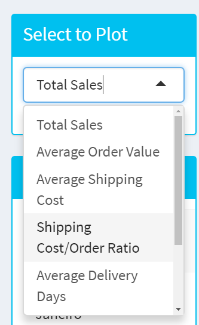
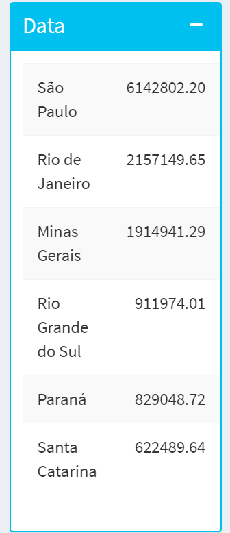
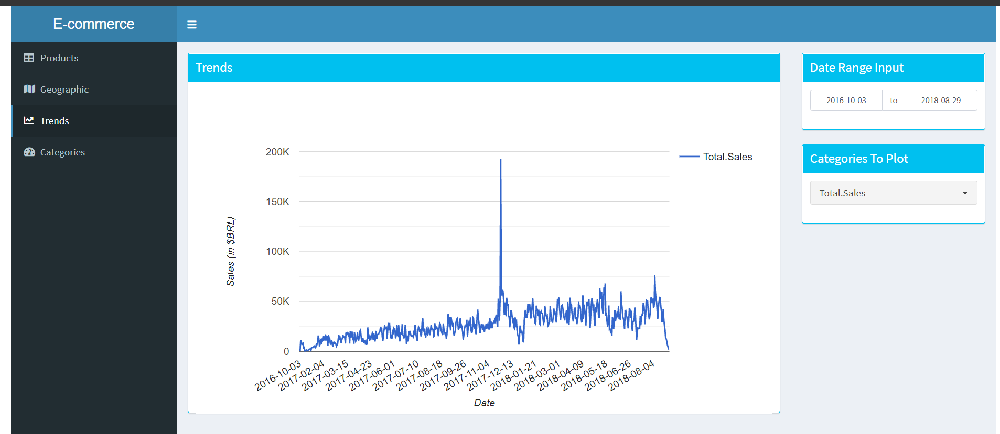
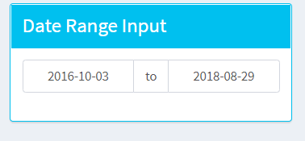
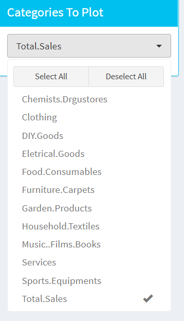
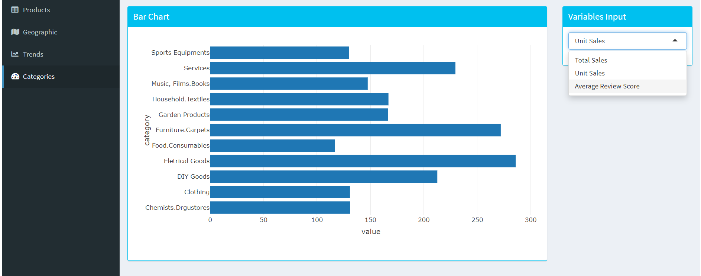

### Introdução
Um dashboard de visualização de dados interativa construída com o pacote R Shiny. O dashboard fornece uma visualização de dados de vendas de um varejista online brasileiro, a partir de 3 seções que permite visualizar os dados de diferentes perspectivas.

### Dataset
O conjunto de dados usado foi do Kaggle.com e é fornecido pela maior loja de departamentos online brasileira, chamada olist. Os dados são estrturados em 8 conjuntos de dados separados referentes a mais de 100 mil informações de pedidos do final de 2016 a 2018. O Dataset pode ser obtido em:  [Kaggle - Brazilian Ecommerce](https://www.kaggle.com/olistbr/brazilian-ecommerce)

O Dataset é divido em 8 arquivos .csv distintos na seguinte modelagem:

Existe também um arquivo com a tradução dos nomes da categoria do produto.

## Seções
O aplicativo foi divido em seções, entre elas:

### Produtos
Permite uma breve visualização em uma tabela da relação dos produtos contidos no Dataset.

### Geográfica
Permite visualizar os dados em um ponto de vista geográfico, conforme mostra imagem abaixo:

\
É possível selecionar o tipo de visualização do mapa, no input abaixo:

\
A tabela abaixo irá listar os 6 primeiros estados, conforme o tipo de visualização selecionada

Ex.: Tabela com a relação dos 6 primeiros estados com o maior montante de vendas.

### Tendências
Permite visualizar as tendências de vendas por categoria de produtos em um intervalo de tempo selecionado.

\
Caso seja necessário visualizar as tendências em um periodo especifico, basta selecionar o intervalo entre as datas no input abaixo:

**`Obs: O intervalo de seleção das datas está limitado ao intervalo da maior e menor data de venda contida no dataset.`**

\
Caso seja necessário também é possível visualizar mais de uma categoria, selecionando-as no input abaixo:

### Categorias
Permite visualizar e comparar o valor total de vendas, vendas por unidade e o score de avaliação dos clientes entre as categorias. A imagem a abaixo fornece uma visualização por unidades vendidas.

\

**Este foi um trabalho para a aula de Computação Científica do Dr. Carlos Holbig pela universidade de Passo Fundo em 2021-2.**